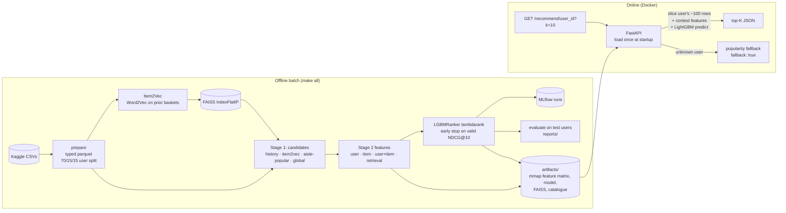

# Next-basket recommender for grocery delivery

Predicts the top-K products in a user's next order from their order history, using the [Instacart Market Basket Analysis](https://www.kaggle.com/datasets/psparks/instacart-market-basket-analysis) dataset (3.4M orders, 206k users, 50k products).

Two stages: candidate retrieval (about 100 items per user from four sources), then a LightGBM `lambdarank` ranker. Served by FastAPI in Docker at p95 7.5 ms.



## Results

Full dataset, 19,682 held-out test users never used for fitting or tuning. Ground truth is every product in the user's last order, including first-time purchases. Full metrics (including @20) are in [`reports/results.md`](reports/results.md) and [`reports/metrics.json`](reports/metrics.json).

| System | Recall@10 | Precision@10 | NDCG@10 | MAP@10 | HitRate@10 |
|---|---:|---:|---:|---:|---:|
| (a) Global popularity | 0.0706 | 0.0727 | 0.0988 | 0.0447 | 0.4604 |
| (b) User's most frequent items | 0.3299 | 0.2734 | 0.3965 | 0.2710 | 0.8518 |
| (c) Retrieval score only | 0.3423 | 0.2864 | 0.4141 | 0.2890 | 0.8561 |
| **(d) Two-stage (retrieval + LGBM)** | **0.3608** | **0.3032** | **0.4381** | **0.3108** | **0.8727** |

Paired bootstrap over test users (1,000 resamples), two-stage minus baseline:

| Baseline | Δ Recall@10 [95% CI] | Δ NDCG@10 [95% CI] |
|---|---:|---:|
| (b) most frequent items | +0.0309 [+0.0292, +0.0327] | +0.0416 [+0.0399, +0.0431] |
| (c) retrieval only | +0.0186 [+0.0171, +0.0200] | +0.0241 [+0.0227, +0.0254] |

Baseline (b) is strong. The ranker beats it by 3.1 points Recall@10 (+9.4% relative) and 4.2 points NDCG@10 (+10.5%). The gain is statistically clear but modest.

**Candidate recall (test users):** 0.6164 with all sources, the ceiling for the ranker (history only 0.5895; Item2Vec 0.1333; aisle-popular 0.1349; global 0.0886). Average candidates per user: 98.0. 40.5% of ground-truth items are first-time purchases, which caps recall more than the ranker does.

**Latency** (1,000 sequential requests, k=10, 4 vCPUs, Docker, full artifacts; [`reports/latency.json`](reports/latency.json)):

| p50 | p95 | p99 | max |
|---:|---:|---:|---:|
| 5.69 ms | 7.49 ms | 9.85 ms | 19.57 ms |

At k=50, p95 is 8.95 ms. Startup takes 0.84 s and the container uses about 207 MiB RSS, because the 2.6 GB feature matrix is memory-mapped.

## Design

- **Two stages.** Scoring 50k products per user is too slow. Retrieval cuts the pool to about 100 items at 61.6% recall, and the ranker orders them. The ranker's top 20 recovers 46.7% of next-basket items, about three quarters of what the pool contains.
- **Lambdarank.** Order within a user's list matters, not cross-user calibration. Groups are users; early stopping uses validation NDCG@10. Users with no positive among their candidates are dropped from training and early stopping only. All reported metrics include every user.
- **Candidate cap of 100.** Costs about 1 point of history recall for heavy users; bounds latency and memory.
- **Precomputed static features plus request-time context.** Keeps p95 under 10 ms; features are as fresh as the last batch run.
- **Item2Vec** is Word2Vec over baskets with window 20, since baskets are unordered. It mostly adds discovery candidates.
- **Unknown users** get global popularity with `"fallback": true`.

### Leakage controls

- Users are split 70/15/15 with a fixed seed. The ranker is fit on train users, early-stopped on valid users, and test users are scored once.
- Labels come only from `order_products__train`. All features and candidates (including embeddings and popularity) use prior orders only. The target order contributes only its metadata (hour, day of week, days since prior order), which is known at request time.
- `tests/test_leakage.py` replaces every target-order product, rebuilds the pipeline, and asserts the 32 static features and all context features are bit-for-bit identical. It also asserts every history order precedes the target order.
- Training and serving share `add_context()`. `tests/test_api.py::test_serving_matches_offline_scores` checks that API scores equal offline scores.

## Run

Requires Python 3.11 (full run: 4 vCPUs, 15 GB RAM) and Kaggle credentials in `~/.kaggle/kaggle.json`.

```bash
make setup                 # venv + pinned deps
make all SAMPLE=1          # ~10% of users, ~2 min
make all                   # full data, ~20 min (Item2Vec ~6 min, ranker ~3.5 min)
make test                  # 21 tests on synthetic fixtures, no Kaggle needed
make serve                 # API on :8000 (or: docker compose up)
make bench                 # 1,000-request latency benchmark
```

Single steps: `python -m recsys.{data.download,data.prepare,candidates.item2vec,candidates.generate,features.build,ranker.train,evaluate.run,serve.export} [--sample]`. MLflow runs go to `./mlruns` (`mlflow ui --backend-store-uri ./mlruns`).

Docker mounts artifacts read-only; the image holds code only:

```bash
make all
docker compose up --build      # ARTIFACTS_PATH=./artifacts/sample for sample artifacts
```

Optional Streamlit demo: `pip install -r requirements-ui.txt && make ui`.

## API

```bash
curl "localhost:8000/recommend/1?k=3"
```

```json
{
  "user_id": 1, "k": 3, "fallback": false, "model_version": "lgbm-lambdarank-abe0bcb6",
  "context": {"hour": 7, "dow": 1, "days_since_prior": 19.56, "source": "user_default"},
  "items": [
    {"product_id": 196,   "product_name": "Soda",                "aisle": "soft drinks",            "department": "beverages", "score": 3.863},
    {"product_id": 12427, "product_name": "Original Beef Jerky", "aisle": "popcorn jerky",          "department": "snacks",    "score": 3.343},
    {"product_id": 10258, "product_name": "Pistachios",          "aisle": "nuts seeds dried fruit", "department": "snacks",    "score": 3.124}
  ]
}
```

| Endpoint | Purpose |
|---|---|
| `GET /recommend/{user_id}?k=10[&hour=&dow=&days_since_prior=]` | Top-K. Context defaults to the user's habitual hour, weekday and order gap. Unknown user → popularity with `fallback: true`. |
| `GET /users/{user_id}/history?n=20` | User's most-bought items. 404 for unknown user. |
| `GET /similar/{product_id}?k=10` | Item2Vec neighbours (FAISS). 404 if the product has no embedding. |
| `GET /health`, `GET /metadata` | Liveness; model version, trained-at timestamp, feature lists, offline metrics. |

Invalid input (non-positive `user_id`, `k` outside 1–100, `hour` outside 0–23, etc.) returns 422. Each request logs one JSON line with method, path, status and latency.

## Layout

```
configs/default.yaml        hyper-parameters and paths
src/recsys/
  data/                     download, typed parquet + user split, fixture generator
  candidates/               Item2Vec + FAISS, multi-source candidates
  features/                 aggregates, feature schema, shared context function
  ranker/                   dataset assembly, LGBMRanker training + MLflow
  evaluate/                 metrics, baselines, test evaluation + bootstrap CIs
  serve/                    artifact export, FastAPI app, schemas
scripts/benchmark_latency.py
tests/                      metrics, leakage, candidates, API, train/serve parity
notebooks/01_eda.ipynb      EDA on full data
ui/streamlit_app.py         optional demo
reports/                    metrics.json, results.md, latency.json, feature importance
```

CI (`.github/workflows/ci.yml`) runs ruff, black and pytest on fixtures, then builds the Docker image. It never downloads Kaggle data.

## Limitations

- **Feature freshness.** Features come from a batch snapshot. Production would update user×item counters from the order stream.
- **No timestamps.** Item popularity uses all prior orders. No labels leak, but across users it isn't a strict point-in-time cut-off; a real deployment would split by time.
- **Cold start.** Unknown users get global popularity only. New products have no embedding until retraining.
- **Discovery.** Recall on first-time purchases is low. Options: two-tower or item-item retrieval, more non-history candidates for light users, retuned per-source quotas.
- **Offline only.** Recall is a proxy; the real test is an A/B test on add-to-cart rate and basket size.
- **Reproducibility.** Splits, LightGBM and fixtures are seeded. Item2Vec with 4 workers is not bit-for-bit reproducible; set `candidates.item2vec.workers: 1` for exact results at the cost of speed.
