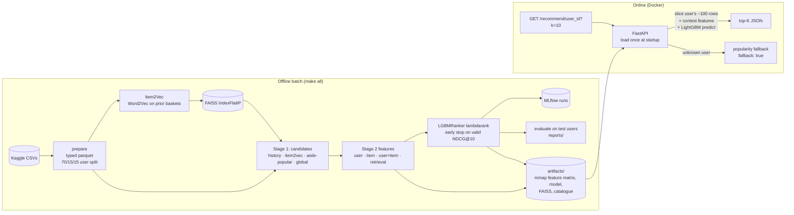
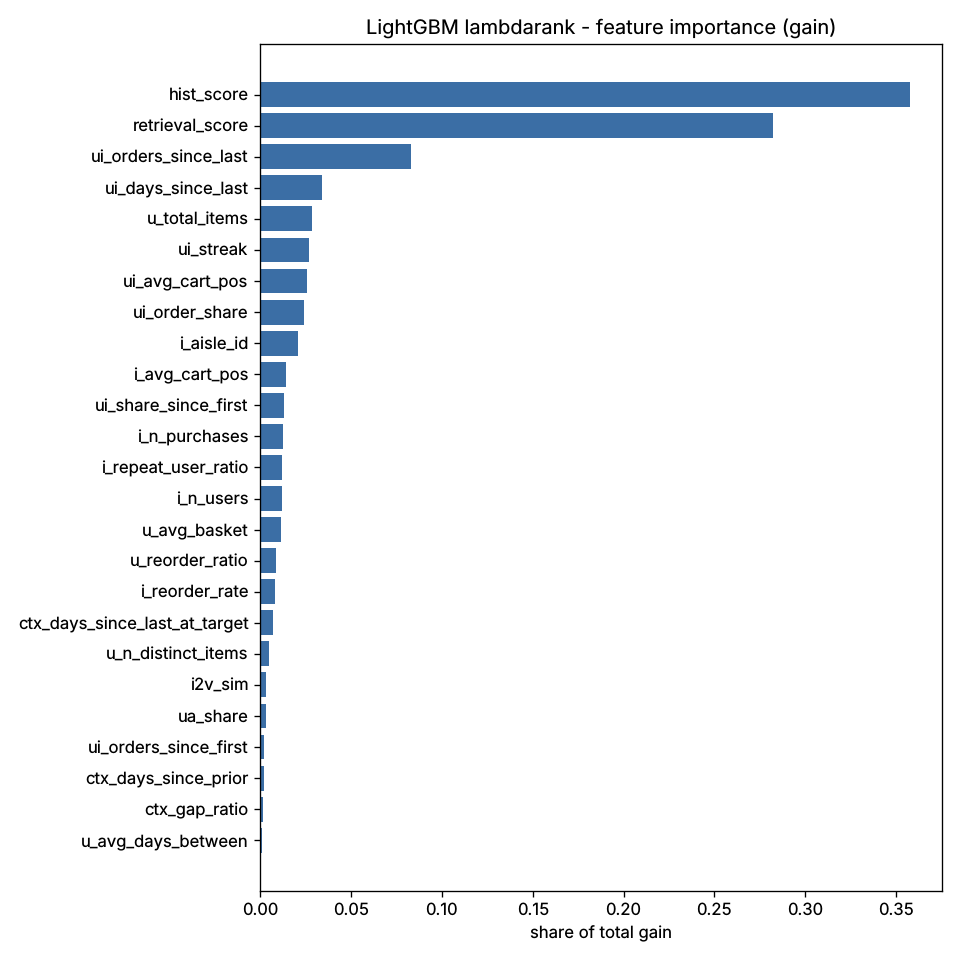

# Next-basket recommender for grocery delivery

A grocery app should show each customer the items they're likely to put in their next basket. This repo builds that system on the [Instacart Market Basket Analysis](https://www.kaggle.com/datasets/psparks/instacart-market-basket-analysis) dataset: 3.4M orders, 206k users and 50k products. Given a user's order history, it predicts the top-K products of their next order.

The pipeline has two stages. Candidate retrieval pulls about 100 items per user from several sources, and a LightGBM `lambdarank` model then ranks them. A FastAPI service in Docker serves the model with a p95 latency of 7.5 ms. Evaluation is user-level and held out, with no label leakage, and the system is compared against strong baselines.

## Architecture



## Results

All numbers come from `make all` on the full dataset. The ranker was never fit or tuned on the 19,682 held-out test users. Ground truth is every product in the user's last order, including products they had never bought before. Sources: [`reports/results.md`](reports/results.md) and [`reports/metrics.json`](reports/metrics.json).

| System | Recall@10 | Precision@10 | NDCG@10 | MAP@10 | HitRate@10 | Recall@20 | Precision@20 | NDCG@20 | MAP@20 | HitRate@20 |
|---|---:|---:|---:|---:|---:|---:|---:|---:|---:|---:|
| (a) Global popularity | 0.0706 | 0.0727 | 0.0988 | 0.0447 | 0.4604 | 0.0957 | 0.0511 | 0.0983 | 0.0393 | 0.5240 |
| (b) User's most frequent items | 0.3299 | 0.2734 | 0.3965 | 0.2710 | 0.8518 | 0.4382 | 0.1973 | 0.4133 | 0.2650 | 0.9015 |
| (c) Retrieval only (retrieval score) | 0.3423 | 0.2864 | 0.4141 | 0.2890 | 0.8561 | 0.4483 | 0.2042 | 0.4283 | 0.2814 | 0.9000 |
| **(d) Two-stage: retrieval + LGBM lambdarank** | **0.3608** | **0.3032** | **0.4381** | **0.3108** | **0.8727** | **0.4673** | **0.2140** | **0.4506** | **0.3018** | **0.9119** |

To check whether the gain is real, I ran a paired bootstrap over the test users (1,000 resamples):

| Two-stage minus … | Δ Recall@10 [95% CI] | Δ NDCG@10 [95% CI] |
|---|---:|---:|
| (b) user's most frequent items | +0.0309 [+0.0292, +0.0327] | +0.0416 [+0.0399, +0.0431] |
| (c) retrieval only | +0.0186 [+0.0171, +0.0200] | +0.0241 [+0.0227, +0.0254] |

The "buy again" baseline (b) is hard to beat: it reaches Recall@10 of 0.330 with no learning at all. The ranker adds 3.1 points of Recall@10 (+9.4% relative) and 4.2 points of NDCG@10 (+10.5% relative). The intervals are tight, so the gains are statistically clear, but they're modest rather than a step change.

### Candidate generation (Stage 1)

| Metric (test users) | Value |
|---|---:|
| Candidate recall, all sources (the ceiling for the ranker) | 0.6164 |
| Avg candidates per user | 98.0 |
| Candidate recall, history source only | 0.5895 |
| Candidate recall, Item2Vec + FAISS only | 0.1333 |
| Candidate recall, aisle-popular only | 0.1349 |
| Candidate recall, global-popular only | 0.0886 |
| Share of ground-truth items the user had never bought before | 0.4047 |

About 40% of the items in a next basket are first-time purchases, and that share limits recall more than the ranker does. The non-history sources add 2.7 points of candidate recall over history alone.

### Serving latency

Measured with `scripts/benchmark_latency.py`: 1,000 sequential `GET /recommend/{user_id}?k=10` requests for random known users, after 50 warm-up calls. The API ran in the Docker container on 4 vCPUs with the full artifacts (206,209 users, 20.2M candidate rows). Source: [`reports/latency.json`](reports/latency.json).

| p50 | p95 | p99 | max |
|---:|---:|---:|---:|
| 5.69 ms | 7.49 ms | 9.85 ms | 19.57 ms |

With k=50, p95 was 8.95 ms. Startup takes 0.84 s and the container uses about 207 MiB RSS, since the 2.6 GB feature matrix is memory-mapped instead of loaded into the heap.

### Feature importance



The model leans most on recency-weighted purchase frequency (`hist_score`, `retrieval_score`). Next come recency features (`orders_since_last`, `days_since_last`, streak), then basket-position and item-level reorder features.

## Design decisions and trade-offs

### Why two stages?

Scoring all 50k products per user with a feature-rich model is too slow, and nearly all of that work would be wasted. Cheap retrieval cuts the space to about 100 items while keeping 62% recall, and the expensive model then only has to order those items.

It also lets you measure each stage separately, which tells you whether to invest in retrieval or in ranking. Here the candidate pool contains 61.6% of next-basket items, and the ranker's top 20 already recovers 46.7%. So about three quarters of what's reachable is found.

### Why lambdarank?

What matters is the order within one user's list, not probabilities calibrated across users. `lambdarank` optimizes NDCG directly, using pairwise gradients scaled by the change in NDCG. Training groups are users, and early stopping uses validation NDCG@10.

Users with no positive among their candidates add no gradient, and LightGBM would score them as NDCG = 1. They're removed from the training and early-stopping sets only. Every reported metric includes all users.

### How leakage is avoided

Tests enforce this, not just convention.

- **User-level split.** Users are split 70/15/15 with a fixed seed. The ranker is fit on train users and early-stopped on valid users. Test users are scored once.
- **Labels come only from the target order.** Ground truth is `order_products__train`. Every feature and every candidate, including the Item2Vec embeddings and item popularity, is computed from prior orders only. `prior.parquet` can't contain a target order. The target order supplies only its metadata (hour, day of week, days since the previous order), which a real request knows at request time.
- **Tests.** `tests/test_leakage.py` rebuilds the whole pipeline after replacing every target-order product. It asserts that all 32 static features and all context features are bit-for-bit identical while the labels change, and that every history order precedes the target order.
- **One feature path for training and serving.** Context features come from the same `add_context()` function offline and online. `tests/test_api.py::test_serving_matches_offline_scores` checks that API scores equal offline scores.

### Other trade-offs

- **Capping candidates at 100.** History items always rank above unseen items in the pool. The cap costs about 1 point of history recall for heavy users and bounds latency and memory in return.
- **Precomputed static features plus request-time context.** This keeps p95 under 10 ms. The cost is that features are only as fresh as the last batch run (see Limitations).
- **Item2Vec as Word2Vec over baskets.** The window is wide (20) because baskets are sets. It's cheap and gives reasonable neighbours (see the notebook), and it mostly adds discovery candidates.
- **Unknown users.** They get the global popularity list with `"fallback": true`, which is the honest cold-start behavior.

## How to run

You need Python 3.11 (the full run used 4 vCPUs and 15 GB RAM) and Kaggle credentials in `~/.kaggle/kaggle.json`.

```bash
make setup                 # venv + pinned deps (requirements.txt)
make all SAMPLE=1          # ~10% of users, ~2 min: fast iteration
make all                   # full data, ~20 min on 4 vCPUs (Item2Vec ~6 min, ranker fit ~3.5 min): data → features → train → evaluate → artifacts
make test                  # 21 tests on synthetic fixture data (no Kaggle needed)
make serve                 # local API on :8000   (or: docker compose up)
make bench                 # 1,000-request latency benchmark against the running API
```

You can also run the pipeline steps one at a time:
`python -m recsys.{data.download,data.prepare,candidates.item2vec,candidates.generate,features.build,ranker.train,evaluate.run,serve.export} [--sample]`.
MLflow runs are written to `./mlruns`. View them with `mlflow ui --backend-store-uri ./mlruns`.

### Docker

The image contains code only. Artifacts are mounted read-only.

```bash
make all                       # produces ./artifacts
docker compose up --build      # ARTIFACTS_PATH=./artifacts/sample for sample artifacts
```

### API

```bash
curl "localhost:8000/recommend/1?k=3"
```

```json
{
  "user_id": 1, "k": 3, "fallback": false, "model_version": "lgbm-lambdarank-abe0bcb6",
  "context": {"hour": 7, "dow": 1, "days_since_prior": 19.56, "source": "user_default"},
  "items": [
    {"product_id": 196,   "product_name": "Soda",                "aisle": "soft drinks",            "department": "beverages", "score": 3.863},
    {"product_id": 12427, "product_name": "Original Beef Jerky", "aisle": "popcorn jerky",          "department": "snacks",    "score": 3.343},
    {"product_id": 10258, "product_name": "Pistachios",          "aisle": "nuts seeds dried fruit", "department": "snacks",    "score": 3.124}
  ]
}
```

| Endpoint | Purpose |
|---|---|
| `GET /recommend/{user_id}?k=10[&hour=&dow=&days_since_prior=]` | Top-K. Context defaults to the user's habitual hour, weekday and order gap. Unknown user → popularity with `fallback: true`. |
| `GET /users/{user_id}/history?n=20` | The user's most-bought items. Returns 404 for an unknown user. |
| `GET /similar/{product_id}?k=10` | Item2Vec neighbours from the FAISS index. Returns 404 if the product has no embedding. |
| `GET /health`, `GET /metadata` | Liveness check; model version, trained-at timestamp, feature lists, offline metrics. |

Invalid input (a non-integer or non-positive `user_id`, `k` outside 1–100, `hour` outside 0–23, and so on) returns 422. Each request writes one structured JSON log line with method, path, status and latency.

### Optional demo UI

Run `pip install -r requirements-ui.txt && make ui` to open a Streamlit page that shows a user's history next to the API's recommendations.

## Repository layout

```
configs/default.yaml        all hyper-parameters and paths (single source of truth)
src/recsys/
  data/                     Kaggle download, typed parquet + user split, synthetic fixture generator
  candidates/               Item2Vec + FAISS, multi-source candidate generation
  features/                 vectorized aggregates, feature schema, shared context function
  ranker/                   dataset assembly, LGBMRanker training + MLflow
  evaluate/                 metrics, baselines, test-set evaluation + bootstrap CIs
  serve/                    artifact export, FastAPI app, Pydantic schemas
scripts/benchmark_latency.py
tests/                      metrics, leakage, candidate shape, API, train/serve parity
notebooks/01_eda.ipynb      EDA (executed on the full data)
ui/streamlit_app.py         optional demo
reports/                    metrics.json, results.md, latency.json, feature importance
```

CI (`.github/workflows/ci.yml`) runs ruff, black and pytest on synthetic fixture data, then builds the Docker image. It never downloads Kaggle data.

## Limitations and next steps

- **Feature freshness.** User features come from a nightly-style batch snapshot. In production, the user×item counters (times bought, days since last purchase, streak) would be updated from the order stream into an online feature store. Today the context features are the only request-time inputs.
- **Time.** Instacart has no absolute timestamps, so item popularity is computed over all prior orders. Because prior orders always precede each user's own target order, no labels leak. Across users, though, this isn't a strict point-in-time cut-off, and a real deployment would use a time-based split.
- **Cold start.** Unknown users get global popularity only. Next steps are session-based retrieval from the first basket via Item2Vec neighbours (already served by `/similar`) and onboarding preferences. New products have no embedding until the model is retrained, so content embeddings (name, aisle) would help.
- **Discovery.** 40% of next-basket items are first-time purchases, and candidate recall on those is low. Options include better co-purchase retrieval (a two-tower model or an item-item graph), more non-history candidates for light users, and adjusting the per-source quotas.
- **Online evaluation.** Offline recall is only a proxy. The real test is an A/B test on add-to-cart rate and basket size, with guardrails on latency and catalogue coverage, possibly preceded by interleaving.
- **Retraining cadence.** Retrain the ranker and Item2Vec weekly, run feature batches daily, and monitor feature drift and candidate recall. The MLflow run ID is already embedded in `model_version` for traceability.
- **Reproducibility.** Splits, LightGBM and the fixture pipeline are seeded and deterministic. Item2Vec uses 4 worker threads on the full data, which isn't bit-for-bit reproducible. Set `candidates.item2vec.workers: 1` for exact reproducibility, at the cost of slower training.
